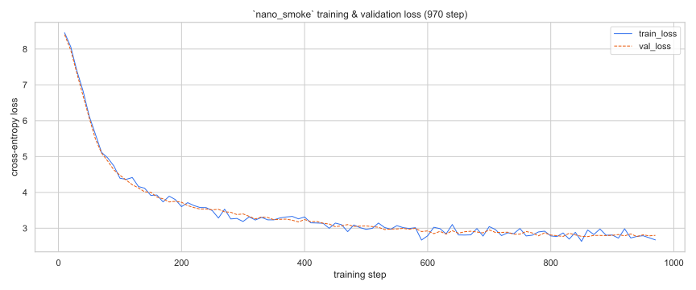
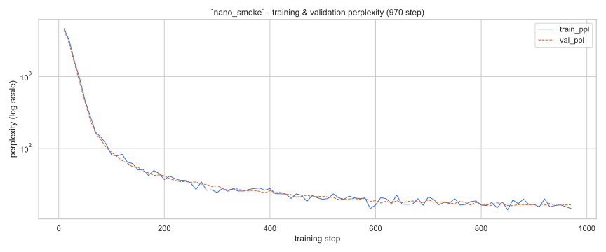
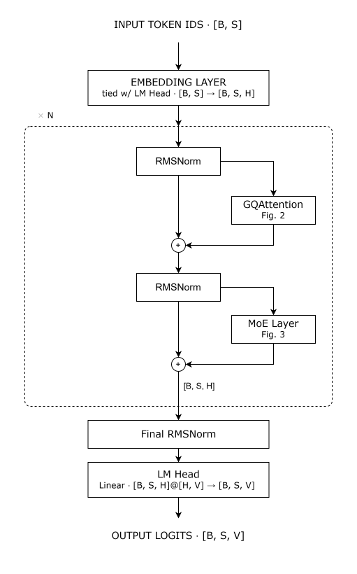
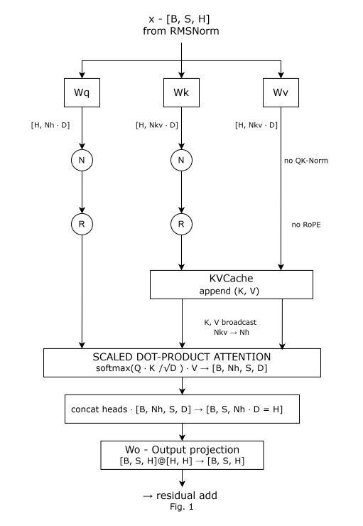
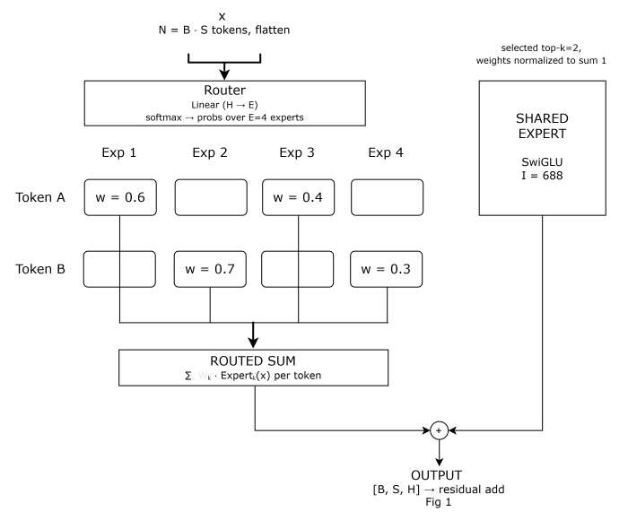
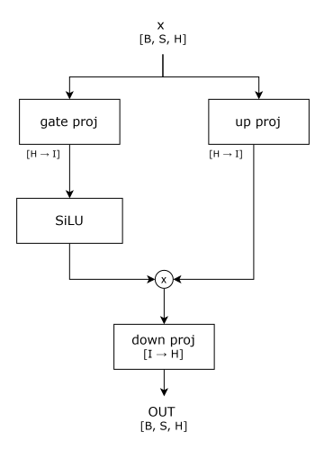

<div align="center">

# GQA-MoE

*Decoder-only* model trained from scratch in PyTorch, with an architecture that combines GQA attention with QK-Norm, RoPE, and KV cache, together with FFN layers based on Mixture-of-Experts with top-k routing and a shared expert, while the internal feed-forward components use SwiGLU. The project is available in two configurations designed to run on consumer hardware: NANO, with 19.8M parameters, and SMALL, with 155.3M parameters.


</div>

---

## Table of Contents
- [Project Structure](#project-structure)
- [Installation](#installation)
- [Usage](#usage)
- [Results](#results)
- [Architecture](#architecture)
    - [Model Overview](#model-overview)
    - [GQAttention](#gqattention)
    - [MoE Routing](#moe-routing)
    - [FFN SwiGLU](#feed-forward-swiglu)
    - [Tensor Shape Reference](#tensor-shape-reference)
    - [Parameter Count](#parameter-count)
- [Configuration Reference](#configuration-reference)
- [References](#references)
- [Scope and Intent](#scope-and-intent)

---
## Project Structure

```text
root/
├── README.md
├── requirements.txt
├── .gitignore
│
├── configs/                            # YAML configurations for the presets
│   ├── nano.yml                        # NANO: 19,811,328 parameters
│   ├── nano_smoke.yml                  # NANO with a reduced token budget (~976 steps), for an end-to-end smoke test
│   └── small.yml                       # SMALL: 155,339,264 parameters
│
├── src/                                
│   ├── __init__.py
│   ├── config.py                       # Model/Train/RuntimeConfig dataclasses + RunConfig (presets, YAML, cross invariants)
│   ├── model/                          # model components, depending only on config + torch
│   │   ├── __init__.py
│   │   ├── blocks/                     # mutually independent base components
│   │   │   ├── __init__.py             
│   │   │   ├── norm.py                 # RMSNorm
│   │   │   ├── rope.py                 # RoPE precomputation and application
│   │   │   └── ffn.py                  # SwiGLU
│   │   │
│   │   ├── attention.py                # GQA + QK-Norm + RoPE + KV cache
│   │   ├── kv_cache.py                 # KVCache: K/V state for each layer
│   │   ├── moe.py                      # router, experts, shared expert and aux loss
│   │   ├── block.py                    # TransformerBlock
│   │   └── transformer.py              # full Transformer implementation
│   │
│   ├── data/                           # data handling, with no dependencies on model/
│   │   ├── __init__.py
│   │   ├── train_tokenizer.py          # BPE training: raw corpus -> vocab.json/merges.txt
│   │   ├── prepare_data.py             # download, batching, encoding and memmap
│   │   ├── dataset.py                  # BinDataset and get_batch()
│   │   └── tokenizer.py                # wrapper for BPE encode/decode
│   │
│   ├── runtime/                        # training and generation orchestration
│   │   ├── __init__.py
│   │   ├── schedule.py                 # TrainingSchedule: AdamW decay/no-decay, clipping, warmup -> cosine decay
│   │   ├── trainer.py                  # training loop, checkpoint/resume
│   │   ├── metrics.py                  # StepMetrics and recorder: readable train.log + metrics.jsonl
│   │   ├── sampler.py                  # SamplingPolicy: greedy/temperature/top-k/top-p
│   │   └── generator.py                # TextGenerator: autoregressive generation with KV cache
│   │
│   └── cli/                            # command-line entry points
│       ├── __init__.py
│       ├── train_tokenizer.py          # BPE training CLI: argument parsing and launch of train_bpe()
│       ├── prepare_data.py             # data-prep CLI: argument parsing and launch of prepare_data()
│       ├── train.py                    # training CLI: configuration parsing and Trainer launch
│       └── generate.py                 # generation CLI: checkpoint loading and text generation
│
├── tests/                              # tests organized as a mirror of src/
│   ├── conftest.py                     # shared fixtures, including a synthetic BinDataset
│   ├── test_config.py                  # dataclasses, invariants, presets, YAML and parameter counting
│   ├── test_attention.py               # shapes, causality and equivalence with KV cache
│   ├── test_kv_cache.py                # length, concatenation, dtype and growth of the KVCache
│   ├── test_moe.py                     # shapes, aux loss, expert utilization and gradients
│   ├── test_block.py                   # TransformerBlock, including the KV cache
│   ├── test_transformer.py             # full model, tied embeddings, initialization and end-to-end cache
│   ├── test_data.py                    # tokenizer pipeline, memmap, get_batch and batching with mocked network
│   ├── test_tokenizer.py               # BPE round-trip, special tokens and compression
│   ├── blocks/                         # mirror of src/model/blocks/
│   │   ├── test_norm.py
│   │   ├── test_rope.py
│   │   └── test_ffn.py
│   │
│   ├── runtime/                        # mirror of src/runtime/
│   │   ├── test_schedule.py
│   │   ├── test_trainer.py
│   │   ├── test_metrics.py
│   │   ├── test_sampler.py
│   │   └── test_generator.py
│   │
│   └── cli/                            # mirror of src/cli/, with end-to-end smoke tests
│       ├── test_train.py
│       ├── test_generate.py
│       ├── test_prepare_data.py
│       └── test_train_tokenizer.py
│
├── data/                               # artifacts generated by the data pipeline (not versioned)
│   ├── raw/                            # raw TinyStories corpus: train.txt, valid.txt
│   ├── processed/                      # tokenized corpus in memmap format: train.bin, val.bin, meta.json
│   └── tokenizer/                      # trained BPE tokenizer: vocab.json, merges.txt
│
├── docs/
│   ├── diagrams/                       # .svg diagrams for the Architecture section
│   └── plots/                          # .svg charts used in the Results section
│
└── runs/                               # not-versioned directory: checkpoints, train.log and metrics.jsonl
```

The `data/`, `notebooks/`, and `runs/` directories contain locally generated artifacts and are excluded from version control via `.gitignore`; they are recreated by following the steps in the [Usage](#usage) section.

---
## Installation

### Prerequisites
- **Python 3.12+**
- An NVIDIA GPU with CUDA (*optional*) to speed up training. The entire pipeline can also be run on CPU, naturally with longer training times; for an example designed to run on CPU, see `configs/nano_smoke.yml`.

### Setup

**1. Clone the repository**
```bash
git clone https://github.com/<your-username>/GQA-MoE.git
cd GQA-MoE
```

**2. Create a virtual environment and install dependencies**
```bash
python -m venv venv
source venv/bin/activate        # Windows: venv\Scripts\activate
pip install -r requirements.txt
```

In addition to the model and pipeline dependencies (`torch`, `numpy`, `tokenizers`, `datasets`, `pyyaml`, `requests`, `tqdm`) and `pytest` for the test suite, `requirements.txt` also includes `pandas`, `matplotlib`, `seaborn`, and `jupyter`, used exclusively by the notebook that generates the charts in the [Results](#results) section.

---
## Usage

### 1. Data preparation
Download **TinyStories** from HuggingFace, train the BPE tokenizer on the training corpus, and encode the train and validation datasets in `uint16`/`uint32` memmap format:
```bash
python -m src.cli.prepare_data --vocab-size 8000
```
Once finished, `data/raw/`, `data/tokenizer/`, and `data/processed/{train.bin,val.bin,meta.json}` are populated (see [Project Structure](#project-structure)). The destination directories can be changed with `--raw-dir`, `--tokenizer-dir`, and `--bin-dir`. The value of `--vocab-size` must match the configuration you intend to train with: `configs/nano.yml` and the `nano` preset use `8000`, while `configs/small.yml` requires a dataset prepared with `--vocab-size 16000`.

A separate CLI is also available for training just the BPE tokenizer on a corpus already present locally, without re-running download and encoding:

```bash
python -m src.cli.train_tokenizer data/raw/train.txt --vocab-size 8000 --out-dir data/tokenizer
```

### 2. Training
```bash
python -m src.cli.train --preset nano --data-dir data/processed --run-dir runs/nano
```

or:

```bash
python -m src.cli.train --config configs/nano.yml --data-dir data/processed --run-dir runs/nano
```

The `--preset` option selects a predefined configuration via `RunConfig.preset` (`nano`, `small`, `overfit`), reading the `vocab_size` from `meta.json`, while `--config` lets you specify a YAML file directly, e.g. `configs/small.yml`, which declares its own `vocab_size` and takes priority over the preset. In both cases the model's `vocab_size` is compared with that of the dataset, and a mismatch stops training with an explicit error. With `--resume` it is instead possible to resume training from a previously saved checkpoint. During execution, the `Trainer` periodically saves checkpoints and produces a final checkpoint inside the directory specified by `--run-dir`.

### 3. Generation
To generate text from a checkpoint, simply specify the model path and the initial prompt:

```bash
python -m src.cli.generate --checkpoint runs/nano/final.pt --prompt "Once upon a time,"
```
or:

```bash
python -m src.cli.generate --checkpoint runs/nano/final.pt --prompt "Once upon a time," --max-new-tokens 100 --temperature 0.8 --top-k 40 --top-p 0.95
```
The command loads the checkpoint, automatically reconstructs the `ModelConfig` from the saved metadata, and generates text autoregressively using the KV cache. The `--temperature`, `--top-k`, and `--top-p` parameters allow you to control the sampling behavior (see `src/runtime/sampler.py`).

### Tests
To run the test suite:

```bash
python -m pytest
```

---
## Results

### Training sanity check (`nano_smoke`)
The [`nano_smoke.yml`](configs/nano_smoke.yml) preset keeps the same architecture as **NANO**, but uses a significantly reduced token budget, with ~976 steps compared to the ~48,800 of the full preset. It is therefore not intended to bring the model to convergence, but to verify that the entire pipeline — from data preparation and the tokenizer through training, checkpoint saving, and generation — works correctly end-to-end and that the model starts producing at least partially coherent text. The run reported below was executed on a single **NVIDIA® GeForce RTX™ 3050 Laptop GPU 4GB GDDR6 128-bit 1172.5 MHz**.

During training, `Trainer` emits a `StepMetrics` record for each logging step with `train_loss`/`train_ppl`/`val_loss`/`val_ppl`, which the recorder writes both as a readable line in `train.log` and as a JSON object in `metrics.jsonl`; for implementation details, see [`src/runtime/metrics.py`](src/runtime/metrics.py). Perplexity is calculated solely from the cross-entropy, not from the total loss used for optimization, which also includes the MoE router's aux loss. The latter is a regularization term with no probabilistic interpretation, as described in the [MoE Routing](#moe-routing) section.


<div align="center">
    <picture>
        
    </picture>
    <figcaption>Plot 1 - "nano_smoke" training and validation loss curves.</figcaption>
</div>

---

<div align="center">
    <picture>
        
    </picture>
    <figcaption>Plot 2 - "nano_smoke" training and validation perplexity curves.</figcaption>
</div>

---

| Metric | Step | Loss | Perplexity |
| :--- | :---: | :---: | :---: |
| train_loss (init) | $10$ | $8.453688$ | $\approx 4692$ |
| val_loss (init) | $10$ | $8.401475$ | $\approx 4454$ |
| val_loss (min) | $860$ | $2.767336$ | $\approx 15.9$ |
| train_loss (final) | $970$ | $2.673985$ | $\approx 14.5$ |
| val_loss (final) | $970$ | $2.801939$ | $\approx 16.5$ |

Perplexity is calculated as `exp(loss)`. With `vocab_size = 8,000`, an initial value of about $4,692$ is consistent with a model that, in the early stages of training, behaves randomly relative to a vocabulary of this size. The average speed measured considering only `train_step()` is about $1.16 s/step$ (median $\approx 1.10 s$, over 97 sampled steps), with `batch_size=16` and `block_size=512`. This value does not include the time spent in `evaluate()`, which with `eval_interval=10` runs every 10 steps, significantly affecting the overall run duration.

The full log is available at `runs/nano_smoke/train.log`, with the same records in machine-readable form in `runs/nano_smoke/metrics.jsonl`, from which the notebook `notebooks/plot_training_curves.ipynb` generates the charts above. The `runs/` and `notebooks/` directories are not versioned and are generated locally by following the instructions in the [Usage](#usage) section.

The text generated from the final checkpoint, using `--top-p 0.95 --temperature 0.8`, already shows fair sentence-level coherence, in line with the preset's goal, namely verifying that the entire pipeline works correctly, without aiming for model convergence.

```
Once upon a time, there was a little girl named Lily. She loved to play outside in the living room. One day, she found a big, white found two some shiny paper. She asked her mom, "Look at that boy, Tom!"  Lily said, "It's a cart! Let's put it together!"  The guard was scared, but she put her warm tap in the slides. She wished it could get a little bit better. She ran back to her mom and said, "H mis, I will take you inside the house."  The sun went very fast. Lily's mom was very scared. "I am sorry, Lily," she said. "You did not share your birthday!"  Lily felt very sad. She never saw the white cat again. She knew she had flew away.
```

---
## Architecture

### Model overview
In the full forward pass, the input token sequence is first projected into the residual stream through the embedding and then processed sequentially by the $N$ `TransformerBlock`s. Each block applies its own GQA and the corresponding MoE layer in a pre-norm configuration, keeping a residual connection around each of the two components. At the output of the last block, the state is normalized via a final RMSNorm and then projected into the vocabulary space by the linear LM head (`hidden_dim -> vocab_size`), whose weights are shared with those of the input embedding. The result is the logits vector, used during training to compute the cross-entropy and, during generation, to determine the next token via sampling.

<div align="center">
    <picture>
        
    </picture>
    <figcaption>Fig. 1 - Full forward pass: embedding, N transformer blocks (pre-norm GQA + pre-norm MoE), final RMSNorm, linear LM head</figcaption>
</div>

### GQAttention
Within each block, the normalized input is projected into query, key, and value. The queries use `n_heads` full heads, while key and value use a reduced number of heads, `n_kv_heads`, following the Grouped-Query Attention (GQA) mechanism, in which each KV head is shared by a group of query heads, thereby reducing the memory required for the KV cache. Before applying the positional encoding, query and key pass through QK-Norm, an RMSNorm applied separately to each head over the `head_dim` dimension rather than across the whole `hidden_dim`, with the goal of keeping the scale of the attention scores under control even as model depth increases.

RoPE is then applied, rotating the component pairs of query and key as a function of position in the sequence. During incremental generation, the position also accounts for the length already present in the KV cache, so as to preserve the correct relative position of new tokens. At inference time, the newly computed keys and values are appended to the layer's KV cache, after which the KV heads are replicated, or broadcast, up to `n_heads`, allowing causal scaled dot-product attention to be performed between all query heads and their respective KV heads. The head outputs are then concatenated and projected back into the residual stream through the output projection `Wo`.

<div align="center">
    <picture>
        
    </picture>
    <figcaption>Fig. 2 - GQAttention: Q/K/V projections, QK-Norm, RoPE, KV cache, head broadcast, scaled dot-product attention</figcaption>
</div>

### MoE Routing
The feed-forward layer of each block is implemented as a Mixture-of-Experts (MoE), in which a linear router assigns each token a score, obtained via softmax, across all `n_experts` available. For each token, only the top-k experts with the highest score are then selected, and their weights are renormalized so that they sum to 1. The token is thus processed only by the selected experts, each of which consists of an independent SwiGLU network, and the result is obtained as a weighted sum of their contributions. The unselected experts perform no computation for that token, making the computational path effectively sparse.

In parallel, a shared expert, always active and independent of routing, processes every token, and its output is added to that produced by the selected experts. This mechanism maintains shared capacity across all tokens, regardless of the router's decisions. During training, an auxiliary load-balancing loss is also computed, which penalizes overly unbalanced routing distributions and encourages the router to use the experts more uniformly.

<div align="center">
    <picture>
        
    </picture>
    <figcaption>Fig. 3 - MoE routing: per-token top-k expert selection plus an always-on shared expert</figcaption>
</div>

### Feed-forward SwiGLU
Each expert, whether routed or shared, internally uses a SwiGLU variant, in which the input is processed in parallel by two independent linear projections, `gate_proj` and `up_proj`, both mapping to the same intermediate dimension. The output of `gate_proj` passes through the SiLU activation and is then multiplied element-wise by the output of `up_proj`, introducing a gating mechanism that lets the network dynamically modulate how much information passes through each intermediate unit. The result is finally projected back to the original `hidden_dim` via `down_proj`. Compared to classic two-layer FFNs based on ReLU or GELU, this gated variant generally offers a more expressive representation and, for the same parameter budget, can deliver better performance.

<div align="center">
    <picture>
        
    </picture>
    <figcaption>Fig. 4 - SwiGLU feed-forward: gate_proj + SiLU, up_proj, elementwise multiply, down_proj</figcaption>
</div>

### Tensor Shape reference

<div style="display: flex; gap: 2rem; align-items: flex-start;">

<div>

| Legend |  |
| :--- | :--- |
| B | batch size |
| S | seq len |
| H | hidden dim |
| V | vocab size |
| Nh / Nkv | query/kv heads |
| D | head dim |
| I | intermediate size |
| E | num experts |

</div>

<div>

| Stage | OP | Shape |
| :--- | :--- | :--- |
| Embedding | lookup | $[B, S]$ &#8594; $[B, S, H]$ |
| $Q$ proj & reshape | $[B, S, H]$@$[H, Nh \cdot D]$ | &#8594; $[B, Nh, S, D]$ |
| $K$ / $V$ proj & reshape | $[B, S, H]$@$[H, Nkv \cdot D]$ | &#8594; $[B, Nkv, S, D]$ |
| Attention scores | $Q \cdot K^{T}/\sqrt{D}$ | $[B, Nh, S, S]$ |
| Context vectors | softmax $\cdot$ V (kv broadcast) | $[B, Nh, S, D]$ |
| Concat heads | reshape | $[B, S, Nh \cdot D] = [B, S, H]$ |
| Output proj (Wo) | $[B, S, H]$@$[H, H]$ | &#8594; $[B, S, H]$ |
| Router logits | $[B, S, H]$@$[H, E]$ | &#8594; $[B, S, E]$ |
| Top-K selection | select K of E, renormalize | $[B, S, K]$ |
| Expert gate/up proj | $[\dots, H]$@$[H, I]$ | &#8594; $[\dots, I]$ |
| Expert down proj | $[\dots, I]$@$[I, H]$ | &#8594; $[\dots, H]$ |
| MoE combined output | routed_sum + shared_expert(x) | $[B, S, H]$ |
| LM Head projection | $[B, S, H]$@$[H, V]$ | &#8594; $[B, S, V]$ |

</div>

</div>

### Parameter Count

The parameter counts reported for each preset, as shown in [Project Structure](#project-structure) and the [Preset comparison](#preset-comparison) table, are exactly equal to `sum(p.numel() for p in model.parameters())`, as computed by `Transformer.num_params()` in [`src/model/transformer.py`](src/model/transformer.py). 

Because every weight in the model is either an `nn.Embedding` or an `nn.Linear(..., bias=False)`, the total parameter count can also be derived analytically from `hidden_dim = n_heads * head_dim` ($H$) and the other `ModelConfig` fields. The derivation uses the same tensor shapes shown in the [Tensor Shape Reference](#tensor-shape-reference) table, where $V$ denotes `vocab_size`, $N_h$ and $N_{kv}$ denote the query and KV head counts, $D$ denotes `head_dim`, $E$ denotes `n_experts`, and $I_e$ and $I_s$ denote `expert_intermediate` and `shared_intermediate`.

**Embedding / LM head.** Both presets set `tie_embeddings=True`, which means that `lm_head.weight` and `tok_embeddings.weight` refer to the same tensor, as implemented in [`src/model/transformer.py`](src/model/transformer.py). The shared weight is therefore counted only once:
$$V \cdot H$$

**Per `TransformerBlock`**. Each block, defined in [`src/model/block.py`](src/model/block.py), contributes the following parameters and is repeated `n_layers` times:

| Component | Formula | Notes |
| :--- | :--- | :--- |
| `attention_norm` | $H$ | RMSNorm applied to the residual stream before attention |
| `wq` | $H \cdot (N_h \cdot D)$ | Query projection |
| `wk`, `wv` | $2 \cdot H \cdot (N_{kv} \cdot D)$ | Key and value projections, with fewer heads than `wq` under GQA |
| `wo` | $(N_h \cdot D) \cdot H$ | Attention output projection |
| `q_norm`, `k_norm` | $2D$ | Per head QK Norm applied over `head_dim` |
| `moe_norm` | $H$ | RMSNorm applied before the MoE layer |
| `router` | $H \cdot E$ | Linear router producing one score per expert |
| routed experts | $E \cdot 3 \cdot H \cdot I_e$ | $E$ independent SwiGLU experts, each with `gate_proj`, `up_proj` and `down_proj` |
| shared expert | $3 \cdot H \cdot I_s$ | One always active SwiGLU expert with intermediate size $I_s$ |

Each SwiGLU, whether routed or shared, contributes $3 \cdot H \cdot I$ parameters through its gate, up, and down projections, as described in [Feed-forward SwiGLU](#feed-forward-swiglu). 

All $E$ routed experts are counted in full. `top_k` only determines how many experts are active for each token during training and inference. It does not change the number of experts or their stored parameters. The inactive experts still contain trainable weights, so the sparsity affects computation rather than the total number of stored parameters.

**Final norm.** One additional `RMSNorm(H)` is applied after the final block and before the LM head, contributing: $H$

Adding all components gives the following closed form:

$$
\text{total} = \underbrace{V \cdot H}_{\text{embedding}} \;+\; n_{\text{layers}} \cdot \Big[\underbrace{2H}_{\text{block norms}} + \underbrace{2D}_{\text{QK-Norm}} + \underbrace{2HN_hD + 2HN_{kv}D}_{\text{attention projections}} + \underbrace{HE}_{\text{router}} + \underbrace{3HI_eE + 3HI_s}_{\text{experts}}\Big] \;+\; \underbrace{H}_{\text{final norm}}
$$

**Worked example: SMALL preset.** For [`configs/small.yml`](configs/small.yml), the relevant values are $V=16{,}000$, $H=512$ from $N_h=8$ and $D=64$, $n_{\text{layers}}=16$, $N_{kv}=4$, $E=8$, $I_e=512$, and $I_s=1{,}376$.

| Term | Value |
| :--- | ---: |
| Embedding ($V \cdot H$) | $8{,}192{,}000$ |
| Attention projections per block | $786{,}432$ |
| QK-Norm per block | $128$ |
| Router + 8 routed experts + shared expert, per block | $8{,}409{,}088$ |
| `attention_norm` + `moe_norm`, per block | $1{,}024$ |
| Block subtotal ($9{,}196{,}672$) × 16 layers | $147{,}146{,}752$ |
| Final norm | $512$ |
| **Total** | **$155{,}339{,}264$** |

This matches the value declared in [`configs/small.yml`](configs/small.yml) exactly. Applying the same derivation to [`configs/nano.yml`](configs/nano.yml) gives $19{,}811{,}328$.

Both totals are checked automatically against `Transformer.num_params()` by [`tests/test_config.py`](tests/test_config.py). This ensures that the analytical formula and the implementation cannot silently diverge.

**Non-embedding count.** `num_params(non_embedding=True)` subtracts `tok_embeddings.weight.numel()` from the total parameter count. This is useful when comparing the core transformer capacity of models with different `vocab_size` values, since the embedding table can otherwise have a significant effect on the total. For SMALL, the embedding table accounts for approximately 5.3% of all parameters.

---
## Configuration Reference

Three `frozen` `dataclass`es defined in [`src/config.py`](src/config.py) describe the entire configurable surface of the model and the training pipeline. `RunConfig` collects them into a single value and holds the invariants that none of the three can verify on its own (for example `block_size <= max_seq_len`). It can be constructed in two ways: `RunConfig.preset("nano" | "small" | "overfit", vocab_size)` or `RunConfig.from_yaml(path)` from a file such as [`configs/small.yml`](configs/small.yml) or [`configs/nano_smoke.yml`](configs/nano_smoke.yml), the latter used for the run reported in the [Results](#results) section. In the training CLI, when both are specified, `--config` takes priority over `--preset`; for details, see the [Usage](#usage) section.

### Model Configuration

| Field | Default | Description |
| :--- | :---: | :--- |
| `vocab_size` | *(required)* | Vocabulary size, which must match that of the tokenizer used, as indicated in `meta.json` |
| `n_layers` | `12` | Number of `TransformerBlock`s present in the model |
| `n_heads` | `8` | Number of query heads used by GQA |
| `n_kv_heads` | `2` | Number of KV heads shared across groups of query heads; `n_heads` must be a multiple of this value |
| `head_dim` | `32` | Dimension of each head; `hidden_dim` is computed as `n_heads * head_dim` |
| `n_experts` | `4` | Number of routed experts available in each MoE layer |
| `top_k` | `2` | Number of experts activated for each token, with the constraint `1 <= top_k <= n_experts` |
| `expert_intermediate` | `256` | Intermediate dimension of the SwiGLU used by each routed expert |
| `shared_intermediate` | `688` | Intermediate dimension of the SwiGLU used by the shared expert, equal to ~2.7× `hidden_dim` |
| `max_seq_len` | `1024` | Maximum sequence length used for precomputing RoPE and the KV cache |
| `rms_norm_eps` | `1e-6` | Epsilon value used by the RMSNorms for numerical stability |
| `rope_theta` | `10000.0` | Base used to compute RoPE frequencies |
| `aux_loss_coeff` | `0.01` | Weight of the auxiliary load-balancing loss, applied once to the total loss, as described in the [MoE Routing](#moe-routing) section |
| `tie_embeddings` | `True` | Shares weights between the input embedding and the output LM head |

### Training Configuration

| Field | Default | Description |
| :--- | :---: | :--- |
| `batch_size` | `16` | Number of sequences processed in each batch |
| `block_size` | `512` | Context window length used during training; must be `<= model.max_seq_len` |
| `target_tokens` | `400_000_000` | Total token budget, used to determine `max_steps` |
| `warmup_steps` | `500` | Number of steps dedicated to linear learning-rate warmup |
| `max_lr` / `min_lr` | `3e-4` / `3e-5` | Maximum and minimum learning rate used by the cosine scheduler |
| `weight_decay` | `0.1` | Weight decay applied by AdamW only to weights, excluding biases and normalization parameters |
| `grad_clip` | `1.0` | Maximum gradient norm value, used for gradient clipping |
| `eval_interval` | `500` | Frequency, in steps, at which evaluation on the validation set is performed and `val_loss` is computed |
| `eval_iters` | `50` | Number of validation batches used to compute the average `val_loss` |
| `seed` | `1337` | Seed used for weight initialization via `torch.manual_seed` and, in the training CLI, also for batch sampling. `BinDataset` uses independent generators for the train and validation splits, as described in [src/data/dataset.py](src/data/dataset.py) |

### Runtime Configuration

| Field | Default | Description |
| :--- | :---: | :--- |
| `device` | `cuda` if available, otherwise `cpu` | Device used for training and running the model |
| `dtype` | `float32` | Precision used for computations; `bfloat16` requires `device=cuda` |
| `adam_betas` | `(0.9, 0.95)` | Beta coefficients used by the AdamW optimizer for the first- and second-moment moving averages |
| `adam_eps` | `1e-8` | Epsilon term used by AdamW to ensure numerical stability |
| `log_every` | `10` | Number of steps between successive metric logs in `train.log` and `metrics.jsonl` |
| `checkpoint_every` | `1000` | Number of steps between successive checkpoint saves |

### Preset comparison

| | NANO | SMALL |
| :--- | :---: | :---: |
| Parameters | $19,811,328$ | $155,339,264$ |
| `vocab_size` | $8,000$ | $16,000$ |
| `n_layers` | $12$ | $16$ |
| `n_heads` / `n_kv_heads` | $8$ / $2$ | $8$ / $4$ |
| `head_dim` &#8594; `hidden_dim` | $32$ &#8594; $256$ | $64$ &#8594; $512$ |
| `n_experts` / `top_k` | $4$ / $2$ | $8$ / $2$ |
| `expert_intermediate` / `shared_intermediate` | $256$ / $688$ | $512$ / $1,376$ |
| `max_seq_len` | $1024$ | $2048$ |
| `batch_size` / `block_size` | $16$ / $512$ | $8$ / $1024$ |
| `target_tokens` &#8594; `max_steps` | $400M$ &#8594; ~$48,828$ | $1.5B$ &#8594; ~$183,105$ |

Both parameter counts are verified by the tests in [`tests/test_config.py`](tests/test_config.py). Since `vocab_size` differs between the two presets, the dataset must be prepared with the corresponding value, as indicated in the [Usage](#usage) section.

`overfit` is a third preset, not included in the table because it is intended purely as a diagnostic configuration. It uses a deliberately reduced architecture, with 4 layers and `max_seq_len=128`, and is designed to pass the single-batch overfit gate within a few hundred steps, allowing a quick check that training is working correctly. It is therefore not a configuration intended for training a final model.

---
## References

The main techniques adopted in the model are listed below along with the corresponding reference works. The papers are organized by area, to make it easier to trace the motivation and origin of each architectural and training choice.

### Base architecture

* Vaswani et al., 2017, [Attention Is All You Need](https://arxiv.org/abs/1706.03762), introduces the Transformer architecture and the self-attention mechanism on which the model is based.
* Xiong et al., 2020, [On Layer Normalization in the Transformer Architecture](https://arxiv.org/abs/2002.04745), studies the placement of normalization and motivates the use of the pre-norm configuration adopted in the Transformer blocks.
* Press & Wolf, 2017, [Using the Output Embedding to Improve Language Models](https://arxiv.org/abs/1608.05859), introduces weight tying between input embedding and output embedding, used here between the embedding and the LM head.
* Radford et al., 2019, [Language Models are Unsupervised Multitask Learners](https://cdn.openai.com/better-language-models/language_models_are_unsupervised_multitask_learners.pdf) (GPT-2), provides the reference for `N(0, 0.02)` initialization and for the `1/√(2·n_layers)` scaling applied to residual projections, implemented in `Transformer._init_weights` (see [`src/model/transformer.py`](src/model/transformer.py)).

### Attention

* Ainslie et al., 2023, [GQA: Training Generalized Multi-Query Transformer Models from Multi-Head Checkpoints](https://arxiv.org/abs/2305.13245), introduces and analyzes Grouped-Query Attention (GQA), used to reduce the cost of the KV cache while retaining more query heads.
* Su et al., 2021, [RoFormer: Enhanced Transformer with Rotary Position Embedding](https://arxiv.org/abs/2104.09864), introduces Rotary Position Embedding (RoPE), used to incorporate positional information into queries and keys.
* Henry et al., 2020, [Query-Key Normalization for Transformers](https://arxiv.org/abs/2010.04245), introduces QK-Norm, implemented here as a separate per-head RMSNorm applied before RoPE.
* OLMo et al., 2024, [2 OLMo 2 Furious](https://arxiv.org/abs/2501.00656), reports the adoption of QK-Norm in a production-scale open language model, corroborating its role in stabilizing training as depth and scale increase.
* Pope et al., 2022, [Efficiently Scaling Transformer Inference](https://arxiv.org/abs/2211.05102), analyzes techniques for reducing Transformer inference cost and serves as the reference for using the KV cache in autoregressive generation.
* DeepSeek-AI, 2024, [DeepSeek-V2: A Strong, Economical, and Efficient Mixture-of-Experts Language Model](https://arxiv.org/abs/2405.04434), introduces Multi-head Latent Attention (MLA), an alternative to GQA that compresses the KV cache through a low-rank latent projection instead of sharing KV heads across query groups.

### Normalization and feed-forward

* Zhang & Sennrich, 2019, [Root Mean Square Layer Normalization](https://arxiv.org/abs/1910.07467), introduces RMSNorm, used for normalizing the model's states.
* Shazeer, 2020, [GLU Variants Improve Transformer](https://arxiv.org/abs/2002.05202), presents gated variants of feed-forward networks and serves as the reference for SwiGLU, used in the MoE experts and in the shared expert.

### Mixture-of-Experts

* Shazeer et al., 2017, [Outrageously Large Neural Networks: The Sparsely-Gated Mixture-of-Experts Layer](https://arxiv.org/abs/1701.06538), introduces the sparse top-k routing underlying the MoE mechanism used in the model.
* Fedus et al., 2021, [Switch Transformers: Scaling to Trillion Parameter Models with Simple and Efficient Sparsity](https://arxiv.org/abs/2101.03961), shows how to integrate sparse MoE into large-scale Transformers and is an important reference for the routing design.
* Dai et al., 2024, [DeepSeekMoE: Towards Ultimate Expert Specialization in Mixture-of-Experts Language Models](https://arxiv.org/abs/2401.06066), introduces the concept of an always-active shared expert alongside the specialized, routed experts, adopted in this implementation.
* Wang et al., 2024, [Auxiliary-Loss-Free Load Balancing Strategy for Mixture-of-Experts](https://arxiv.org/abs/2408.15664), proposes replacing the auxiliary load-balancing loss with a dynamically updated per-expert bias, avoiding the interference gradients introduced by the aux-loss-based approach used in this implementation.
* DeepSeek-AI, 2024, [DeepSeek-V3 Technical Report](https://arxiv.org/abs/2412.19437), reports the adoption of the auxiliary-loss-free balancing strategy together with a shared expert at production scale.

### Tokenization

* Sennrich et al., 2016, [Neural Machine Translation of Rare Words with Subword Units](https://arxiv.org/abs/1508.07909), introduces the use of Byte-Pair Encoding as a subword tokenization technique for NLP applications.
* Radford et al., 2019, [Language Models are Unsupervised Multitask Learners](https://cdn.openai.com/better-language-models/language_models_are_unsupervised_multitask_learners.pdf) (GPT-2), introduces the byte-level BPE approach used here via `ByteLevelBPETokenizer` in [`src/data/train_tokenizer.py`](src/data/train_tokenizer.py).

### Optimization and training

* Loshchilov & Hutter, 2019, [Decoupled Weight Decay Regularization](https://arxiv.org/abs/1711.05101), introduces AdamW and the decoupled weight decay used by the model (see [`src/runtime/schedule.py`](src/runtime/schedule.py)).
* Loshchilov & Hutter, 2017, [SGDR: Stochastic Gradient Descent with Warm Restarts](https://arxiv.org/abs/1608.03983), provides the reference for cosine learning-rate decay, used here together with an initial linear warmup.
* Pascanu et al., 2013, [On the Difficulty of Training Recurrent Neural Networks](https://arxiv.org/abs/1211.5063), introduces gradient norm clipping as a technique for limiting exploding gradients, used here via `grad_clip` (see [`src/runtime/schedule.py`](src/runtime/schedule.py)).
* Hoffmann et al., 2022, [Training Compute-Optimal Large Language Models](https://arxiv.org/abs/2203.15556) (Chinchilla), motivates using the number of tokens as the primary training budget, from which `max_steps` is derived (see [`src/config.py`](src/config.py)). For NANO, the configured budget corresponds to about 20.2 tokens per parameter, close to the ~20× ratio associated with the compute-optimal regime discussed in the paper.

### Sampling

* Fan et al., 2018, [Hierarchical Neural Story Generation](https://arxiv.org/abs/1805.04833), introduces top-k sampling, used during generation.
* Holtzman et al., 2019, [The Curious Case of Neural Text Degeneration](https://arxiv.org/abs/1904.09751), introduces nucleus sampling, or top-p sampling, used together with top-k in [`src/runtime/sampler.py`](src/runtime/sampler.py).

### Data

* Eldan & Li, 2023, [TinyStories: How Small Can Language Models Be and Still Speak Coherent English?](https://arxiv.org/abs/2305.07759), introduces TinyStories, the synthetic corpus used to train the model.
* Finke et al., 2025, [Parameterized Synthetic Text Generation with SimpleStories](https://arxiv.org/abs/2504.09184), proposes a TinyStories-style synthetic dataset generated with more recent models and a parameterized vocabulary, outlining a possible direction for extending the data pipeline.

---
## Scope and Intent

This repository was created primarily for implementation and educational purposes, not as a competitive effort. The goal is not to compete with frontier models or chase state-of-the-art results on public benchmarks, but to build a complete, understandable system that can be trained end-to-end on consumer hardware. The NANO and SMALL presets are in fact intentionally sized to keep training within reach of a single personal machine, with computational budgets that remain several orders of magnitude below those required by modern production models.

The project's main goal is to make every component of a modern training pipeline understandable and verifiable, from positional encoding to sparse expert routing, from the KV cache to learning-rate scheduling, all the way to tokenization and sampling strategies. Every major component is implemented from scratch in PyTorch, described and motivated in the [Architecture](#architecture) section, traced back to the original works in the [References](#references) section, and accompanied by targeted tests that verify its expected properties. These include shape correctness, attention causality, the equivalence between generation with and without the KV cache, and correct gradient propagation through MoE routing. The goal is therefore to avoid hiding complexity behind high-level abstractions and to make explicit how the individual mechanisms that make up the model actually work.

The project's value therefore lies in the traceability of its architectural choices and in the verifiability of its implementation, rather than in the absolute quality of the generated text or the performance achieved on benchmarks.